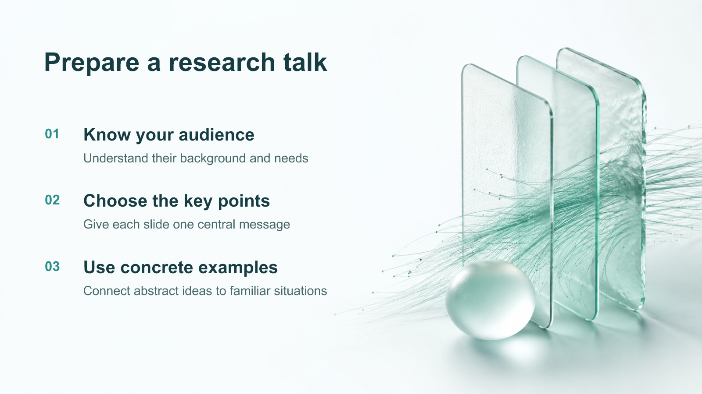
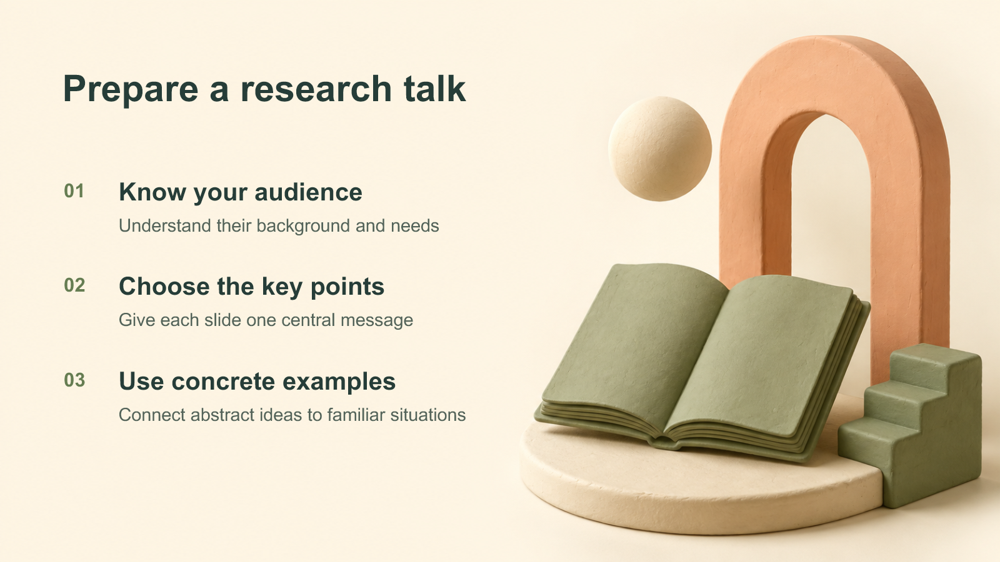

# Multi-style editable PPT

[繁體中文](README.md) · [English](README.en.md)

**Understand the audience, compare visual directions, and create AI backgrounds with independently editable PowerPoint text.**

An independent Codex skill derived from the outline, sample-review and slide-QA workflow in [codex-ppt-skill](https://github.com/ningzimu/codex-ppt-skill), extended with the style index and prompt templates from [awesome-gpt-image-2](https://github.com/freestylefly/awesome-gpt-image-2).

## Real examples

These examples use the same content in three styles. Each image is **rendered from the editable PPTX**. The text is a native PowerPoint layer, separate from the generated background.

### Clinical clarity

For professional education, healthcare proposals and research talks. Light space, restrained teal and translucent glass.



### Soft 3D clay

For introductory lessons and concept explanations. Warm cream, sage green and tactile clay.



### Cinematic dark

For talks, vision presentations and launches. Deep blue-black, cyan light and controlled contrast.


[Download the six-slide editable PPTX (Traditional Chinese + English)](examples/style-samples.pptx) · [Text-free backgrounds](examples/backgrounds/) · [Full generation prompts](examples/prompts.json)

The backgrounds were generated with Codex's built-in `image_gen` tool. The tool did not disclose the exact model, so these images are not labeled as verified GPT Image 2 outputs. The skill supports an Image 2 workflow; use a backend that exposes model identity when exact model selection is required.

## Capabilities

- Plan for the audience, prior knowledge, purpose, duration and information density.
- Explore 12 upstream PPT references, 12 additional deck recipes and 22 image-template entries.
- Recommend three directions by default, with no more than five per comparison round.
- Generate comparable samples from the same content before producing the full deck, unless the user has already authorized autonomous selection.
- Keep headings, body copy, citations and page numbers as native text; replace backgrounds independently.
- Preserve specifications, prompts, backgrounds and build inputs for later editing.

The 24 directions are 12 original references plus 12 derived recipes, with some aesthetic overlap. Three have real examples here; this is not a collection of 24 finished PowerPoint master templates.

## Installation

Give Codex this request:

```text
Install the skill at skills/codex-ppt-style-expanded from
https://github.com/bobyu89/codex-ppt-style-expanded.
Back up any existing skill with the same name and preserve my custom styles.
```

Alternatively, download this repository and copy the entire `skills/codex-ppt-style-expanded` folder to your Codex skills directory. For project-local use, place it inside that project's `.agents/skills/`. Invoke `$codex-ppt-style-expanded` in a new task.

## Usage

```text
Use $codex-ppt-style-expanded to turn this document into a 10-slide deck
for first-year graduate students, for a 15-minute lesson.
Recommend three styles and create samples using the same content.
Use Image 2 backgrounds and keep all text editable.
Wait for my style choice before building the full deck.
```

```text
Use $codex-ppt-style-expanded to compare clinical clarity, soft 3D clay
and cinematic dark for a research talk. Keep the sample content identical.
Let me combine the palette of one option with the illustration treatment of another.
```

Workflow: **understand the brief → outline → shortlist up to five styles → build real samples → agree on a design → produce and inspect each slide**.

## Additional recipes

| ID | Style | Typical use |
|---|---|---|
| `clinical-calm` | Clinical clarity | Healthcare, professional education |
| `academic-editorial` | Academic editorial | Research, papers, defense talks |
| `friendly-clay` | Soft 3D clay | Introductory lessons, concepts |
| `japanese-paper` | Japanese paper | Humanities, warm brand stories |
| `premium-brand` | Premium branding | Formal proposals, brand identity |
| `futuristic-light` | Bright future tech | AI, platforms, engineering |
| `cinematic-dark` | Cinematic dark | Talks, vision, launches |
| `nature-science` | Nature science | Ecology, environment, education |
| `ink-humanities` | Ink humanities | Culture, history, art |
| `architectural-space` | Architectural space | Cities, spaces, design |
| `documentary-photo` | Documentary photography | Social topics, illustrative cases |
| `bold-poster` | Bold poster | Events, talks, key messages |

Edit [styles.json](skills/codex-ppt-style-expanded/references/styles.json) to add a recipe with its audience, palette, material, layout, `template_id` and background prompt. The [style expansion guide](skills/codex-ppt-style-expanded/references/style-expansion.md) contains layout and safe-zone guidance. Skill instructions and detailed references are primarily in Chinese; the agent should respond in the user's language.

## Local tools

Style discovery only needs Python:

```bash
python -X utf8 skills/codex-ppt-style-expanded/scripts/search_styles.py --list
python -X utf8 skills/codex-ppt-style-expanded/scripts/search_styles.py --query "education 3D" --limit 5
python -X utf8 skills/codex-ppt-style-expanded/scripts/search_styles.py --show friendly-clay
```

The basic PPTX assembler requires `python-pptx`:

```bash
python -m pip install -r requirements.txt
python skills/codex-ppt-style-expanded/scripts/assemble_editable.py deck.json deck.pptx
```

It supports text, rectangles, images and speaker notes. See the [production reference](skills/codex-ppt-style-expanded/references/production.md) for the JSON format. It is not a complete chart or automatic layout engine. The example PPTX was authored with Codex's Artifact Tool; see [examples](examples/README.md) for source and portable content data.

## Editability and limits

- Native text remains editable; objects inside a generated background remain raster content.
- Preserve charts, tables and evidence as native objects or original assets. Do not invent data through image generation.
- Image generation requires an available tool. Render the final PPTX to check fonts, overflow and contrast.
- The examples passed structural checks, native-text verification and inspection of every rendered slide. They have not been tested in desktop PowerPoint or Google Slides.
- GitHub previews are static images. Download the PPTX to edit the text.

## Credits and license

Thanks to [ningzimu/codex-ppt-skill](https://github.com/ningzimu/codex-ppt-skill) and [freestylefly/awesome-gpt-image-2](https://github.com/freestylefly/awesome-gpt-image-2). This is an independent derivative, not an official upstream release.

Project code and text are available under the [MIT License](LICENSE). Original upstream notices are preserved in [licenses](skills/codex-ppt-style-expanded/licenses/); pinned versions and changes are recorded in [SOURCES.md](skills/codex-ppt-style-expanded/SOURCES.md). Example backgrounds were generated for this project. Upstream gallery images are not redistributed.
