# SlideWeave｜圖敘簡報

**把內容講清楚，把風格做出來，把文字留給你修改。**

[繁體中文](README.md) · [English](README.en.md) · [下載可編輯範例](examples/cross-matrix/cross-matrix.pptx) · [瀏覽風格](#全部-36-種內建風格)

SlideWeave 是供 Codex 使用的簡報製作 Skill。從主題、文件或零散筆記出發，先理解受眾、整理敘事，再用實際樣張討論風格；以 AI 圖像搭配原生文字，製作能繼續修改的 PowerPoint。

**36 種風格 · 可編輯文字 · draw.io 流程圖 · 研究與教學 · PechaKucha**

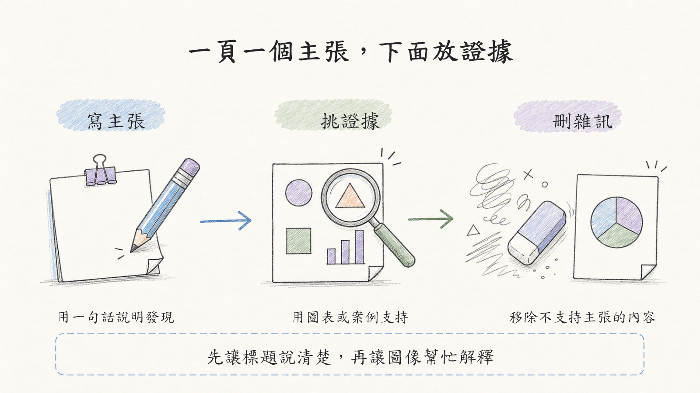

上圖為實際可編輯 PPT 的渲染預覽。標題與說明是原生文字，插畫是獨立背景。

## 開始使用

**第一次使用**，將這段貼給 Codex：

```text
請從 https://github.com/bobyu89/codex-ppt-style-expanded
安裝 skills/codex-ppt-style-expanded。
若已有同名 Skill，請保留我的自訂內容並先備份。
```

**安裝後**，帶上你的文件或主題：

```text
請使用 $codex-ppt-style-expanded。
主題是「我的研究如何改善臨床工作」，對象是剛入學的研究生，講 10 分鐘。
先整理核心訊息與內容結構，再推薦三種風格並製作樣張。
文字保留可編輯，研究流程另提供 .drawio 原始檔。
```

SlideWeave 是新的展示名稱；Skill 呼叫名稱仍為 `$codex-ppt-style-expanded`，GitHub 網址與安裝路徑沿用原設定。也可下載 ZIP，把 Skill 資料夾放入 Codex skills 目錄或專案的 `.agents/skills/`。

## 從內容到簡報

| 階段 | 我們會一起完成什麼 |
|---|---|
| 了解需求 | 用途、聽眾、時間、素材，以及學校／公司／實驗室背景；已有答案不重問 |
| 整理內容 | 核心訊息、章節與代表頁；資料不足之處明確標示 |
| 看圖選風格 | 預設比較三種、每輪最多五種；同內容使用適合各風格的構圖 |
| 製作與檢查 | 生成背景、加入原生文字和需要的圖解，再檢查來源、版面與可讀性 |
| 交付與修改 | 提供 PPTX、背景、提示詞及重建資料；有流程圖時附 .drawio |

可以自然地說：「保留 A 的手繪感，但文字再正式一點」或「用 B 的正文，封面改成 C」。不需要先懂設計術語。

## 不同場合，不同講法

| 場合 | 內容重點 |
|---|---|
| 研究發表 | 核心發現、主張與證據、來源與限制；研究計畫不預先捏造結果 |
| 教學訓練 | 一頁一個概念，以步驟、對照和具體案例解說 |
| PechaKucha | 完整格式為 20 頁 × 20 秒，共 6 分 40 秒；另準備講稿並試講 |
| 提案與工作分享 | 讓聽眾理解問題、選項與下一步 |

場合、節奏與視覺風格可以組合，例如「研究故事 × PechaKucha × 手繪圖解」。[查看模式規則](skills/codex-ppt-style-expanded/references/presentation-modes.md)

<a id="全部-27-種內建風格"></a>

<a id="全部-33-種內建風格"></a>

## 全部 36 種內建風格

以下直接展示全部風格封面。每種附用途、規格與 ID，看中後可直接指定給 Codex。

這裡的 36 張繁中封面是**點陣式風格參考**，不是 36 套可編輯母片。實際簡報會依內容重製無字背景，再加入原生文字。另有 22 個生圖提示詞模板作為素材資源，不計入風格數量。

### 手繪擴充 · 9 種方向

可直接指定自有編號 HW01–HW09 或完整 ID。下方是新生成的點陣封面參考，並非可編輯 PPT 渲染圖，也不作為已驗證的 Image 2.5 實測。

| | |
|---|---|
| **HW01 · 石墨研究筆記**<br>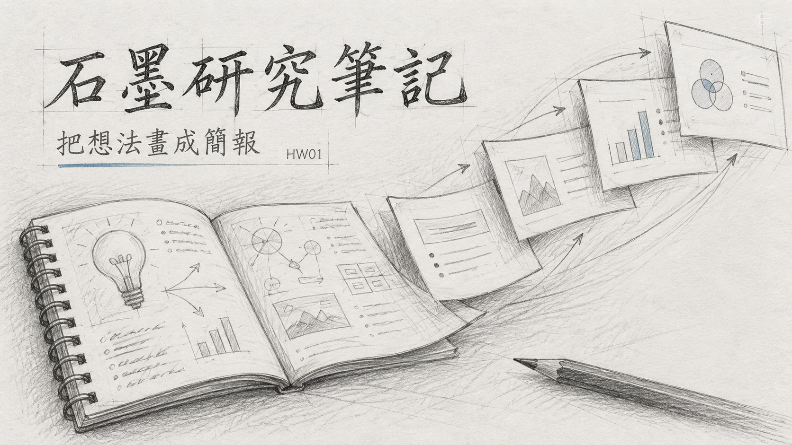<br>研究方法、結構與觀察<br>`graphite-research` | **HW02 · 色鉛筆手帳**<br>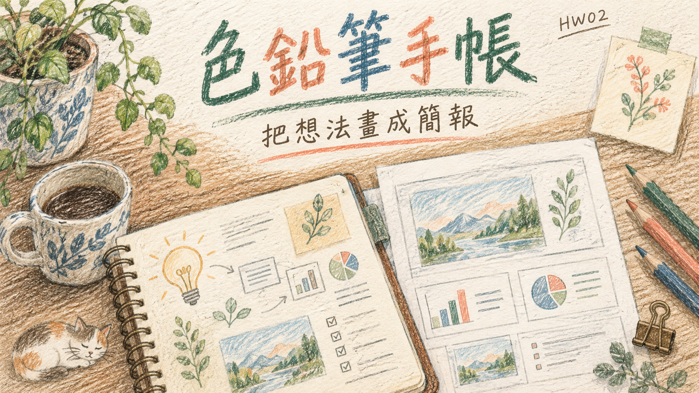<br>學習紀錄、生活與反思<br>`colored-pencil-journal` |
| **HW03 · 蠟筆故事**<br><br>入門教學、親子與故事<br>`crayon-story` | **HW04 · 粉筆黑板**<br><br>投影教學、概念推導<br>`chalk-classroom` |
| **HW05 · 鋼筆編輯插畫**<br>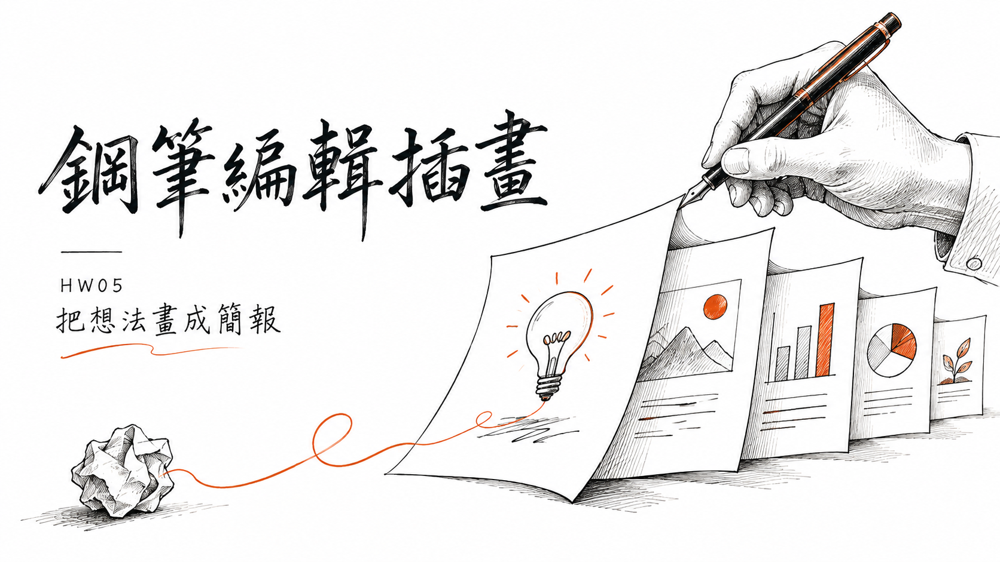<br>人文專題、觀點與介紹<br>`fineliner-editorial` | **HW06 · 麥克筆視覺筆記**<br><br>工作坊、重點整理與討論<br>`marker-sketchnote` |
| **HW07 · 雙色孔版印刷**<br><br>文化活動、創意提案<br>`risograph-duotone` | **HW08 · 手工剪紙拼貼**<br>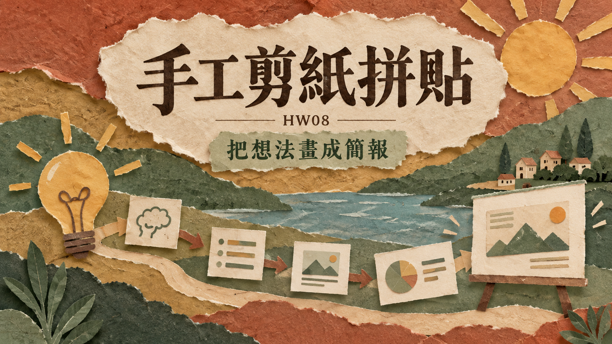<br>故事教學、社區與人文<br>`cut-paper-collage` |
| **HW09 · 極簡單格漫畫**<br>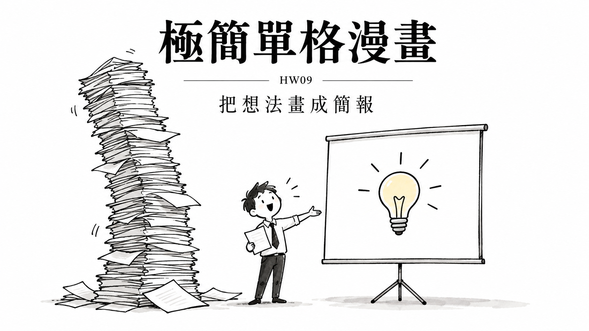<br>演講開場、觀點與概念反思<br>`single-panel-cartoon` |  |

字體可以獨立搭配：任何 HW 風格都能選擇「手寫標題＋清楚正文」。例如：「使用 HW08；標題採可編輯手寫字，正文使用清楚的繁中字體。」

[手繪配方與用法](skills/codex-ppt-style-expanded/references/handdraw-styles.md) · [Image 2.5 適配](skills/codex-ppt-style-expanded/references/image25-workflow.md)

### 幾何與強烈視覺 · 4 種

| | |
|---|---|
| **包浩斯幾何**<br><br>設計、創新、概念提案<br>`bauhaus-geometric` · [Spec](skills/codex-ppt-style-expanded/references/styles.json)<br>[參考來源](https://slidesgo.com/theme/bauhaus) | **孟菲斯活力**<br><br>工作坊、教育、活動<br>`memphis-playful` · [Spec](skills/codex-ppt-style-expanded/references/styles.json)<br>[參考來源](https://slidesgo.com/theme/orange-memphis) |
| **工程藍圖**<br>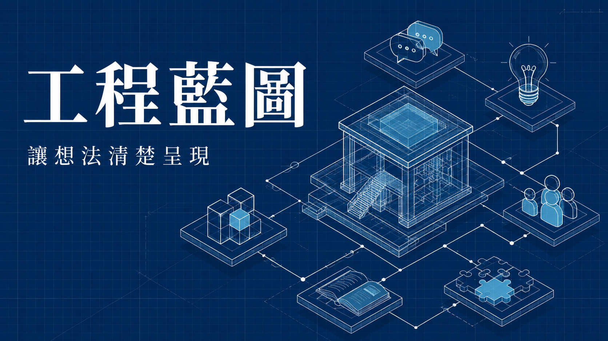<br>工程、系統、技術規劃<br>`technical-blueprint` · [Spec](skills/codex-ppt-style-expanded/references/styles.json)<br>[參考來源](https://www.slidescarnival.com/template/valentine-free-presentation-template/234) | **新粗獷主義**<br><br>產品發表、創意提案、觀點演講<br>`neo-brutalist` · [Spec](skills/codex-ppt-style-expanded/references/styles.json)<br>[參考來源](https://slidesgo.com/brutalist) |


### 原始風格 · 11 種

| | |
|---|---|
| **清爽專業**<br><br>商務報告、專業提案<br>`ppt:清爽专业风` · [Spec](skills/codex-ppt-style-expanded/references/upstream-ppt/清爽专业风.md) | **創意雜誌**<br><br>創意演講、品牌敘事<br>`ppt:创意杂志风` · [Spec](skills/codex-ppt-style-expanded/references/upstream-ppt/创意杂志风.md) |
| **電子墨水雜誌**<br><br>黑白閱讀、文字導向分享<br>`ppt:电子墨水杂志风` · [Spec](skills/codex-ppt-style-expanded/references/upstream-ppt/电子墨水杂志风.md) | **數據儀表板**<br><br>指標、營運、成果比較<br>`ppt:数据仪表盘风` · [Spec](skills/codex-ppt-style-expanded/references/upstream-ppt/数据仪表盘风.md) |
| **復古扁平插畫**<br><br>科普、故事、概念解說<br>`ppt:复古扁平插画风` · [Spec](skills/codex-ppt-style-expanded/references/upstream-ppt/复古扁平插画风.md) | **手繪技術圖解**<br>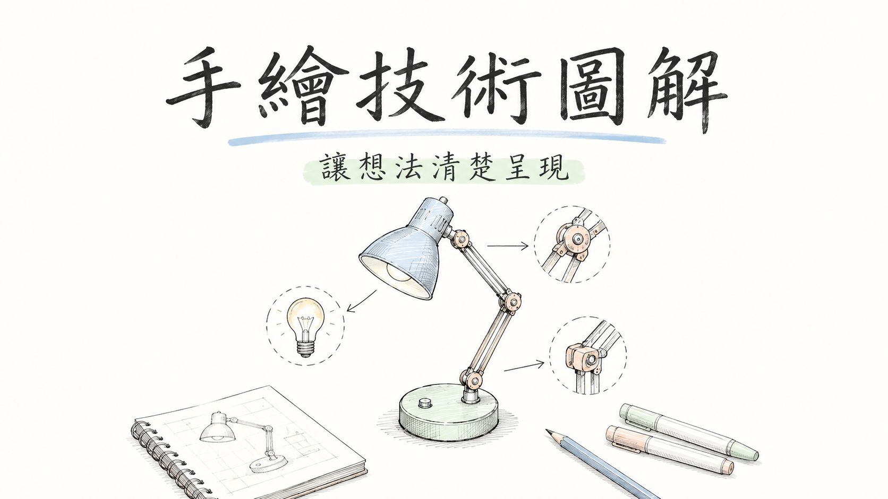<br>技術原理、流程、研究教學<br>`ppt:手绘技术解释风` · [Spec](skills/codex-ppt-style-expanded/references/upstream-ppt/手绘技术解释风.md) |
| **手繪白板**<br>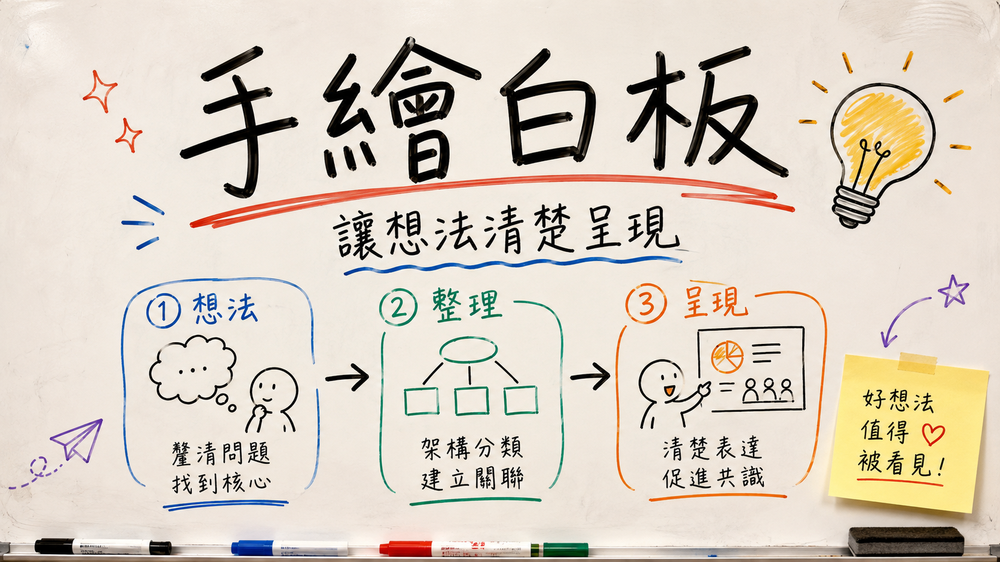<br>工作坊、腦力激盪、步驟講解<br>`ppt:手绘白板风` · [Spec](skills/codex-ppt-style-expanded/references/upstream-ppt/手绘白板风.md) | **溫暖手工**<br><br>人文、教育、溫暖故事<br>`ppt:温暖手工风` · [Spec](skills/codex-ppt-style-expanded/references/upstream-ppt/温暖手工风.md) |
| **科學研究**<br><br>論文口試、研究發表<br>`ppt:科研答辩风` · [Spec](skills/codex-ppt-style-expanded/references/upstream-ppt/科研答辩风.md) | **麥肯錫顧問風**<br><br>策略、決策、商業分析<br>`ppt:麦肯锡风格` · [Spec](skills/codex-ppt-style-expanded/references/upstream-ppt/麦肯锡风格.md) |
| **教學課件**<br><br>課堂、訓練、知識分段<br>`ppt:教学课件风` · [Spec](skills/codex-ppt-style-expanded/references/upstream-ppt/教学课件风.md) |  |


### 延伸風格 · 12 種

| | |
|---|---|
| **臨床清晰**<br><br>醫療、資料頁採清楚網格，對照頁兩欄；裝飾遠離證據<br>`clinical-calm` · [Spec](skills/codex-ppt-style-expanded/references/styles.json) | **學術期刊編輯**<br><br>學術、研究問題、方法、結果以不同版型呈現，圖表區大面積留白<br>`academic-editorial` · [Spec](skills/codex-ppt-style-expanded/references/styles.json) |
| **柔和黏土 3D**<br><br>教學、概念頁左文右圖，流程頁原生節點，資料頁減少 3D<br>`friendly-clay` · [Spec](skills/codex-ppt-style-expanded/references/styles.json) | **日系和紙**<br><br>人文、非對稱留白，章節頁安靜，內容頁清楚雙欄<br>`japanese-paper` · [Spec](skills/codex-ppt-style-expanded/references/styles.json) |
| **精品典雅**<br><br>品牌、大標題、低密度內容、比較頁克制網格<br>`premium-brand` · [Spec](skills/codex-ppt-style-expanded/references/styles.json) | **明亮未來科技**<br><br>AI、架構頁用原生線條，內容頁非對稱，資料頁白底<br>`futuristic-light` · [Spec](skills/codex-ppt-style-expanded/references/styles.json) |
| **深色電影敘事**<br><br>演講、少量大字、章節全景、證據頁使用清晰淺色容器<br>`cinematic-dark` · [Spec](skills/codex-ppt-style-expanded/references/styles.json) | **自然科普**<br><br>環境、現象頁圖文並列，機制頁原生流程，資料頁留白<br>`nature-science` · [Spec](skills/codex-ppt-style-expanded/references/styles.json) |
| **水墨人文**<br><br>文化、章節頁大留白，內容頁現代網格，時間線原生<br>`ink-humanities` · [Spec](skills/codex-ppt-style-expanded/references/styles.json) | **建築空間**<br>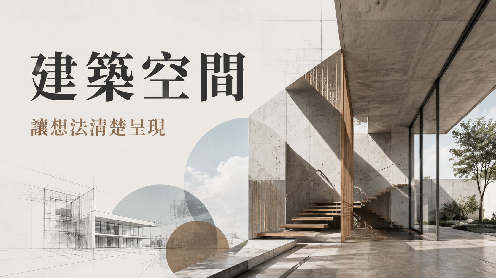<br>設計、封面空間大圖，案例圖文，方案比較兩欄<br>`architectural-space` · [Spec](skills/codex-ppt-style-expanded/references/styles.json) |
| **紀實攝影**<br><br>社會、照片聚焦單側，案例與引言留空白文字區<br>`documentary-photo` · [Spec](skills/codex-ppt-style-expanded/references/styles.json) | **大字海報**<br><br>演講、大字封面與核心句，內頁改用低密度網格<br>`bold-poster` · [Spec](skills/codex-ppt-style-expanded/references/styles.json) |


[完整風格索引](skills/codex-ppt-style-expanded/references/style-catalog.json) · [封面與提示詞](examples/style-catalog/covers-zh-TW/) · [拓展自己的風格](skills/codex-ppt-style-expanded/references/style-expansion.md)

## Image 2.5 適配

已加入媒材特徵、參考圖角色與局部修改規則。可指定 API 模型時，以 Flare 作快速候選起點、Sunburst 處理高要求編修；這是提示詞與流程適配，不是模型權重訓練。內建生圖未回傳型號時，仍標記為未公開。[模型用法與官方來源](skills/codex-ppt-style-expanded/references/image25-workflow.md)。

## 九張交叉範例

以「如何把研究講清楚」為共同主題，比較三種情境與三種風格。以下都是同一份可編輯 PPT 的渲染圖。

| 情境 | 手繪圖解 | 科學研究 | 創意雜誌 |
|---|---|---|---|
| 研究證據 | 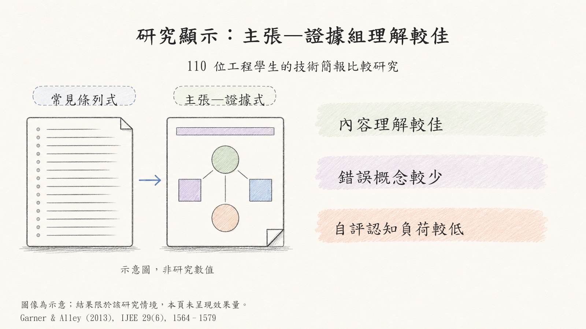 | 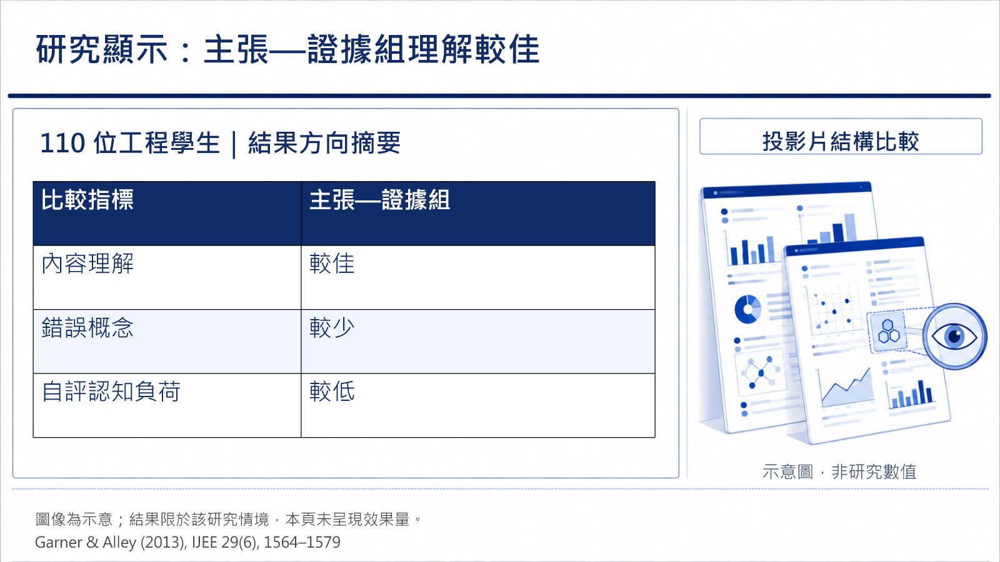 | 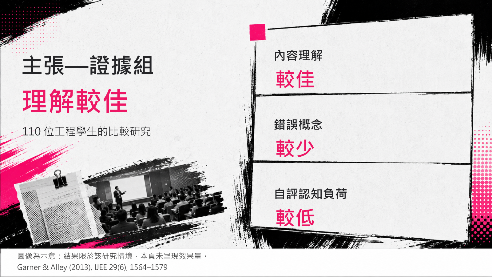 |
| 教學解說 |  | 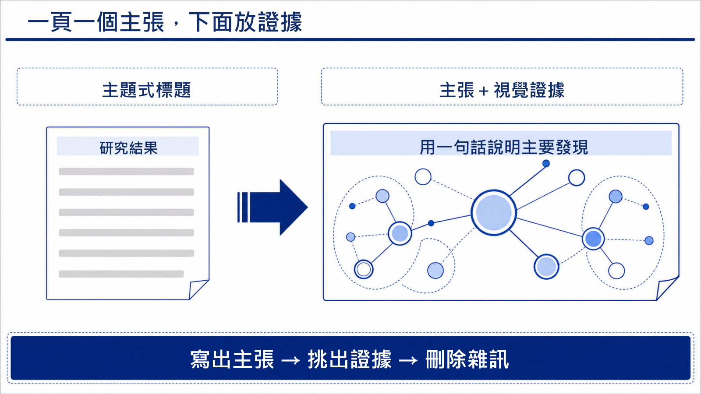 | 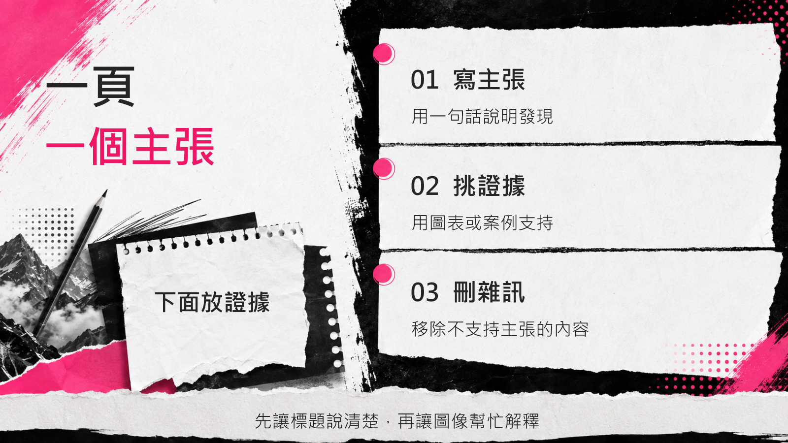 |
| 20 秒短講樣張 |  | 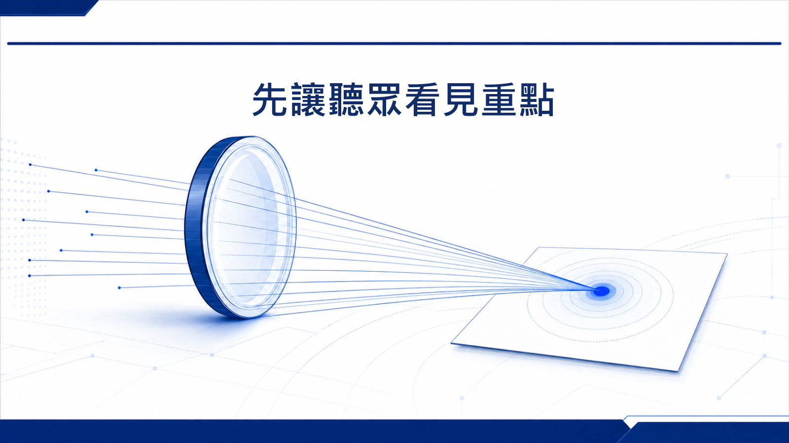 |  |

[下載九頁 PPTX](examples/cross-matrix/cross-matrix.pptx) · [內容、來源與重建說明](examples/cross-matrix/README.md)

研究頁含可編輯證據表格。最後三頁各設 20 秒自動換頁，是節奏樣張；整份九頁比較稿不是完整 PechaKucha。

## 內建流程圖與需求訪談

研究流程、判斷分支、系統架構與泳道圖，可透過內含的 draw.io 工具建立，保留可修改的 `.drawio` 原始檔。訪談採先了解場合、再整理內容與提出風格的方式，避免一開始就填長問卷。

<details>
<summary>查看流程圖範例與使用方式</summary>

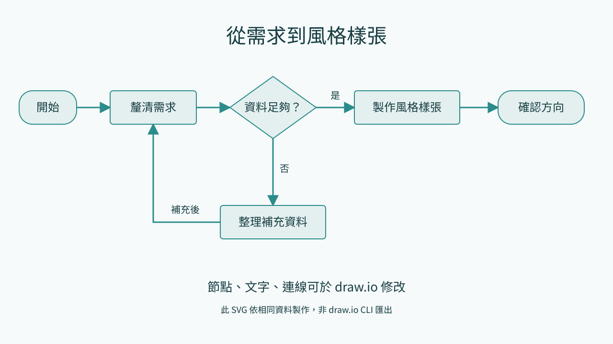

[下載範例與原始檔](examples/flowchart/README.md) · [流程圖規則](skills/codex-ppt-style-expanded/references/flowcharts.md) · [訪談指引](skills/codex-ppt-style-expanded/references/conversation-intake.md)

SVG 為相同節點資料產生的獨立預覽。核心 XML／IR 工具只需 Python；draw.io 原生圖片匯出另需其 CLI。套件不會自動安裝桌面程式或註冊 MCP。

</details>

## 哪些部分能修改？

| 交付內容 | 可編輯範圍 |
|---|---|
| PPT 原生文字、表格 | 可在 PowerPoint 直接修改 |
| AI 背景與封面參考圖 | 點陣圖片；可替換，內部物件無法逐個編輯 |
| .drawio 原始檔 | 可在 draw.io 修改節點、文字與箭頭 |
| 放入 PPT 的流程圖圖片 | 需回原始檔修改；若要求在 PPT 改節點，另以原生形狀與連接線建立 |

範例背景使用內建 `image_gen`，工具未公開確切模型，故不標示為已驗證的 GPT Image 2 輸出。既有 PPT 範例完成結構及逐頁渲染檢查，尚未做桌面 PowerPoint／Google Slides 相容性測試與真人計時試講；draw.io 範例通過結構檢查，未經 draw.io CLI 渲染。

<details>
<summary>開發與進階工具</summary>

```bash
python -X utf8 skills/codex-ppt-style-expanded/scripts/search_styles.py --list
python -X utf8 skills/codex-ppt-style-expanded/scripts/search_styles.py --show technical-blueprint
python skills/codex-ppt-style-expanded/vendor/drawio-skill/scripts/diagramctl.py doctor
```

[基本組裝器與格式](skills/codex-ppt-style-expanded/references/production.md) · [早期樣張](examples/README.md)

</details>

## 來源與授權

SlideWeave 為獨立衍生專案，整合以下來源並保留其授權：

| 專案 | 採用內容 |
|---|---|
| [codex-ppt-skill](https://github.com/ningzimu/codex-ppt-skill) | 風格語言、大綱、樣張與逐頁檢查 |
| [awesome-gpt-image-2](https://github.com/freestylefly/awesome-gpt-image-2) | 風格索引與生圖提示詞資源 |
| [drawio-skill](https://github.com/Agents365-ai/drawio-skill) | 可編輯圖解工具與參考文件 |
| [ppt-image-first](https://github.com/NyxTides/ppt-image-first) | 需求訪談、內容基礎與樣張回饋思路 |

研究與短講規劃另參考[研究簡報文章](https://researcher.tw/articles/conference-talk-slide-craft/)及 [PechaKucha](https://www.pechakucha.com/about)。

原創內容採 [MIT](LICENSE)；draw.io 原檔保留 MIT，改寫的訪談文件保留 Apache-2.0 授權與歸屬。[來源版本及修改說明](skills/codex-ppt-style-expanded/SOURCES.md) · [授權文件](skills/codex-ppt-style-expanded/licenses/)

手繪擴充參考 [yang0/handraw-style](https://github.com/yang0/handraw-style) 的編號選圖概念。查核時未見明示授權，因此未分發其圖片、索引、提示詞或程式；九種配方與封面由本專案另行創作。
