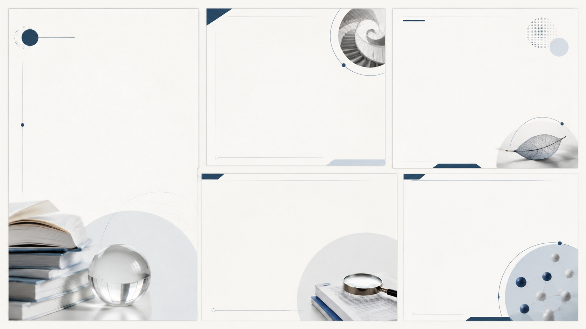
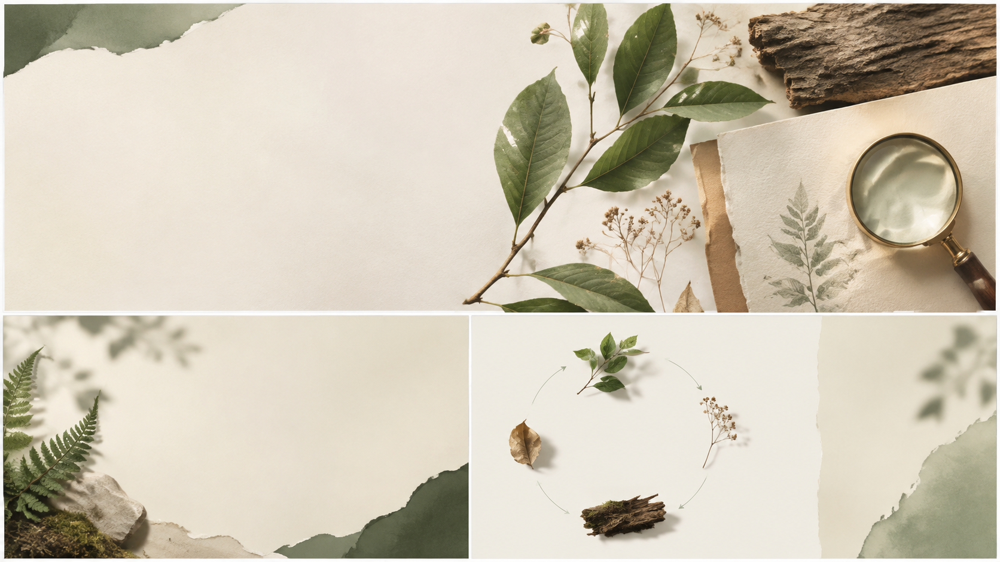
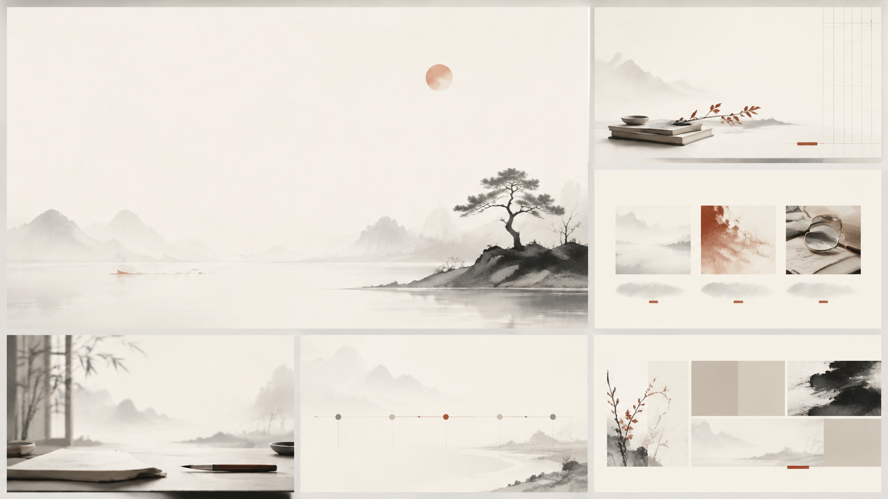
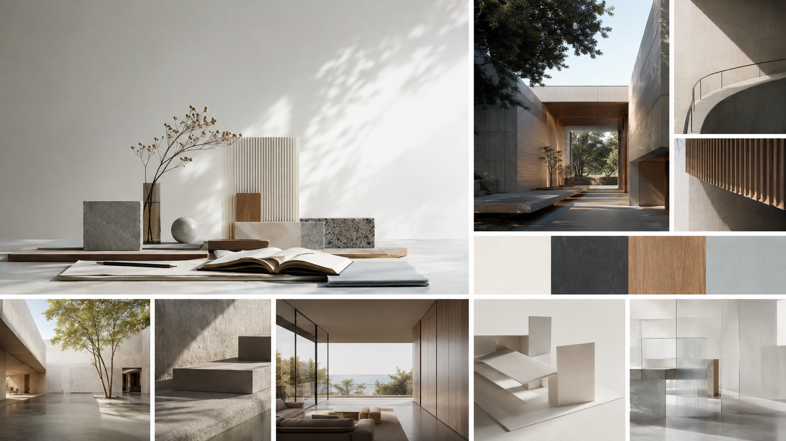

# 多風格可編輯 PPT

[繁體中文](README.md) · [English](README.en.md)

**先了解受眾與情境，再用實際樣張選風格。AI 圖像與原生文字共同構成投影片，文字可獨立修改。**

以 [codex-ppt-skill](https://github.com/ningzimu/codex-ppt-skill) 的圖解、樣張與逐頁檢查流程為基礎，結合 [awesome-gpt-image-2](https://github.com/freestylefly/awesome-gpt-image-2) 的風格索引與提示詞。這是獨立衍生 Skill。

## 全部 24 種內建風格

先看圖，再把風格名稱或下方 ID 交給 Codex。包含 12 種原始參考與 12 種延伸配方；另有 22 個生圖提示詞模板作為素材資源，不額外算成 PPT 風格。

### 12 種原始風格

以下直接展示上游作者的原始風格參考，圖片連結固定於 [codex-ppt-skill 的來源版本](https://github.com/ningzimu/codex-ppt-skill/tree/f2ed80372f65bb05fe62dd07979b239a17ac065d)。這些是視覺參考，並非本專案的可編輯 PPT 渲染圖；圖中文字保留原始語言。

| | |
|---|---|
| **清爽專業**<br><br>商務報告、專業提案<br>上游風格參考 · [規格 / Spec](skills/codex-ppt-style-expanded/references/upstream-ppt/清爽专业风.md)<br>`ppt:清爽专业风` | **創意雜誌**<br><br>創意演講、品牌敘事<br>上游風格參考 · [規格 / Spec](skills/codex-ppt-style-expanded/references/upstream-ppt/创意杂志风.md)<br>`ppt:创意杂志风` |
| **電子墨水雜誌**<br><br>黑白閱讀、文字導向分享<br>上游風格參考 · [規格 / Spec](skills/codex-ppt-style-expanded/references/upstream-ppt/电子墨水杂志风.md)<br>`ppt:电子墨水杂志风` | **數據儀表板**<br><br>指標、營運、成果比較<br>上游風格參考 · [規格 / Spec](skills/codex-ppt-style-expanded/references/upstream-ppt/数据仪表盘风.md)<br>`ppt:数据仪表盘风` |
| **復古扁平插畫**<br><br>科普、故事、概念解說<br>上游風格參考 · [規格 / Spec](skills/codex-ppt-style-expanded/references/upstream-ppt/复古扁平插画风.md)<br>`ppt:复古扁平插画风` | **手繪技術圖解**<br><br>技術原理、流程、研究教學<br>上游風格參考 · [規格 / Spec](skills/codex-ppt-style-expanded/references/upstream-ppt/手绘技术解释风.md)<br>`ppt:手绘技术解释风` |
| **手繪白板**<br><br>工作坊、腦力激盪、步驟講解<br>上游風格參考 · [規格 / Spec](skills/codex-ppt-style-expanded/references/upstream-ppt/手绘白板风.md)<br>`ppt:手绘白板风` | **溫暖手工**<br><br>人文、教育、溫暖故事<br>上游風格參考 · [規格 / Spec](skills/codex-ppt-style-expanded/references/upstream-ppt/温暖手工风.md)<br>`ppt:温暖手工风` |
| **科學研究／答辯**<br><br>論文口試、研究發表<br>上游風格參考 · [規格 / Spec](skills/codex-ppt-style-expanded/references/upstream-ppt/科研答辩风.md)<br>`ppt:科研答辩风` | **麥肯錫顧問風**<br><br>策略、決策、商業分析<br>上游風格參考 · [規格 / Spec](skills/codex-ppt-style-expanded/references/upstream-ppt/麦肯锡风格.md)<br>`ppt:麦肯锡风格` |
| **黨政紅**<br><br>正式政策與機關簡報<br>上游風格參考 · [規格 / Spec](skills/codex-ppt-style-expanded/references/upstream-ppt/党政红风格.md)<br>`ppt:党政红风格` | **教學課件**<br><br>課堂、訓練、知識分段<br>上游風格參考 · [規格 / Spec](skills/codex-ppt-style-expanded/references/upstream-ppt/教学课件风.md)<br>`ppt:教学课件风` |

### 12 種延伸風格

以下三種沿用已有的可編輯 PPT 預覽，另九種新增 AI 視覺示意，展示材質、配色與構圖方向。視覺示意不是完成的投影片或可編輯母片；紀實攝影風的生成圖片也不代表真實事件。

| | |
|---|---|
| **臨床清晰**<br><br>醫療、資料頁採清楚網格，對照頁兩欄；裝飾遠離證據<br>可編輯 PPT 預覽 · [規格 / Spec](skills/codex-ppt-style-expanded/references/styles.json)<br>`clinical-calm` | **學術期刊編輯**<br><br>學術、研究問題、方法、結果以不同版型呈現，圖表區大面積留白<br>AI 視覺示意 · [規格 / Spec](skills/codex-ppt-style-expanded/references/styles.json)<br>`academic-editorial` |
| **柔和黏土 3D**<br><br>教學、概念頁左文右圖，流程頁原生節點，資料頁減少 3D<br>可編輯 PPT 預覽 · [規格 / Spec](skills/codex-ppt-style-expanded/references/styles.json)<br>`friendly-clay` | **日系和紙**<br><br>人文、非對稱留白，章節頁安靜，內容頁清楚雙欄<br>AI 視覺示意 · [規格 / Spec](skills/codex-ppt-style-expanded/references/styles.json)<br>`japanese-paper` |
| **精品典雅**<br><br>品牌、大標題、低密度內容、比較頁克制網格<br>AI 視覺示意 · [規格 / Spec](skills/codex-ppt-style-expanded/references/styles.json)<br>`premium-brand` | **明亮未來科技**<br><br>AI、架構頁用原生線條，內容頁非對稱，資料頁白底<br>AI 視覺示意 · [規格 / Spec](skills/codex-ppt-style-expanded/references/styles.json)<br>`futuristic-light` |
| **深色電影敘事**<br><br>演講、少量大字、章節全景、證據頁使用清晰淺色容器<br>可編輯 PPT 預覽 · [規格 / Spec](skills/codex-ppt-style-expanded/references/styles.json)<br>`cinematic-dark` | **自然科普**<br><br>環境、現象頁圖文並列，機制頁原生流程，資料頁留白<br>AI 視覺示意 · [規格 / Spec](skills/codex-ppt-style-expanded/references/styles.json)<br>`nature-science` |
| **水墨人文**<br><br>文化、章節頁大留白，內容頁現代網格，時間線原生<br>AI 視覺示意 · [規格 / Spec](skills/codex-ppt-style-expanded/references/styles.json)<br>`ink-humanities` | **建築空間**<br><br>設計、封面空間大圖，案例圖文，方案比較兩欄<br>AI 視覺示意 · [規格 / Spec](skills/codex-ppt-style-expanded/references/styles.json)<br>`architectural-space` |
| **紀實攝影**<br><br>社會、照片聚焦單側，案例與引言留空白文字區<br>AI 視覺示意 · [規格 / Spec](skills/codex-ppt-style-expanded/references/styles.json)<br>`documentary-photo` | **大字海報**<br><br>演講、大字封面與核心句，內頁改用低密度網格<br>AI 視覺示意 · [規格 / Spec](skills/codex-ppt-style-expanded/references/styles.json)<br>`bold-poster` |

[查看生圖提示詞](examples/style-catalog/prompts.json) · [完整風格索引](skills/codex-ppt-style-expanded/references/style-catalog.json) · [下載三種早期配方的可編輯範例](examples/style-samples.pptx)

```text
請使用 $codex-ppt-style-expanded，以同一份內容比較
ppt:手绘技术解释风、academic-editorial、ink-humanities。
先做文字可編輯的樣張，讓我選擇方向。
```

## 九張交叉範例

共同主題為「如何把研究講清楚」。同一情境的三張使用相同核心內容，但構圖、字體、圖像與文字的位置依風格重新設計。

| 情境 | 手繪技術圖解 | 科學研究 | 創意雜誌 |
|---|---|---|---|
| 研究：證據摘要 |  |  |  |
| 教學：三步驟解說 |  |  |  |
| PechaKucha：20 秒樣張 |  |  |  |

[下載九頁可編輯 PPTX](examples/cross-matrix/cross-matrix.pptx) · [範例說明與重建方式](examples/cross-matrix/README.md) · [無字背景](examples/cross-matrix/backgrounds/) · [完整提示詞](examples/cross-matrix/prompts.json)

前三頁為研究證據摘要，中間三頁為教學解說，最後三頁為 PechaKucha 節奏樣張。最後三頁各設 20 秒自動換頁；九頁比較稿不是完整的 20×20 簡報。

## 使用流程

1. 了解主題、對象、先備知識、目的、時間、語言與來源。
2. 分別決定使用情境、講述節奏與視覺風格；研究簡報也能採用手繪或雜誌風格。
3. 每輪預設推薦三種、最多五種方向，以同一份內容製作實際樣張。
4. 選定方向後製作整份簡報，保留原生文字、必要的原生表格與講者備註。
5. 渲染並檢查可讀性、內容、來源、版面與時間設定。

研究模式參考[研究簡報文章](https://researcher.tw/articles/conference-talk-slide-craft/)，強調核心訊息、主張與證據、時間分配及附錄。範例研究結果來自 [Garner & Alley (2013)](https://pure.psu.edu/en/publications/how-the-design-of-presentation-slides-affects-audience-comprehens/)，只摘要結果方向，不捏造效果量；第二頁使用可編輯原生表格。完整 PechaKucha 依 [20 張 × 20 秒](https://www.pechakucha.com/about)製作，並需要試講。

## 安裝與使用

把以下提示詞交給 Codex：

```text
請從 https://github.com/bobyu89/codex-ppt-style-expanded
安裝 skills/codex-ppt-style-expanded。
保留既有同名 Skill 的備份，不要覆寫我的自訂風格。
```

也可下載 ZIP，把 `skills/codex-ppt-style-expanded` 複製至 Codex skills 目錄，或專案的 `.agents/skills/`。

```text
請使用 $codex-ppt-style-expanded，根據這份文件製作繁中研究簡報。
對象是剛入學的研究生，預計講 10 分鐘。
先用手繪技術圖解、科學研究、創意雜誌三種風格做樣張。
背景使用 Image 2，文字與證據表格保留可編輯。
等我選定風格後，再完成整份簡報。
```

```text
請使用 $codex-ppt-style-expanded，製作研究故事的 PechaKucha。
完整 20 頁，每頁 20 秒；先規劃故事與講稿，再比較三種風格。
```

## 風格拓展與工具

保留 12 種上游風格參考，另有 [12 種衍生配方](skills/codex-ppt-style-expanded/references/styles.json)及 22 個 Image 2 模板索引。這些是可組合的設計方向，並非 24 套完成的 PowerPoint 母片。完整風格目錄見上方 24 種圖例，九張交叉範例展示其中三種風格的實際應用。

- [風格拓展指南](skills/codex-ppt-style-expanded/references/style-expansion.md)
- [研究、教學與 PechaKucha 規則](skills/codex-ppt-style-expanded/references/presentation-modes.md)
- [基本組裝器與資料格式](skills/codex-ppt-style-expanded/references/production.md)
- [早期背景配色實驗](examples/README.md)

```bash
python -X utf8 skills/codex-ppt-style-expanded/scripts/search_styles.py --list
python -X utf8 skills/codex-ppt-style-expanded/scripts/search_styles.py --query "醫療 教學" --limit 5
```

## 可編輯範圍與限制

- PPT 標題、說明、引用可獨立修改；背景中的插畫仍是點陣圖。
- AI 圖像只作示意，不代替真實研究圖表與數據。
- 範例由內建 `image_gen` 生成背景；工具未公開確切型號，因此不標示為已驗證的 GPT Image 2 輸出。
- 已做 PPTX 結構、原生文字、表格、時間設定與逐頁渲染檢查；尚未做桌面 PowerPoint／Google Slides 相容性測試，講稿尚未真人計時試講。
- GitHub 圖片僅供預覽，編輯請下載 PPTX。

## 來源與授權

程式與文字採 [MIT License](LICENSE)。上游授權保留於 [licenses](skills/codex-ppt-style-expanded/licenses/)，版本與改寫範圍見 [SOURCES.md](skills/codex-ppt-style-expanded/SOURCES.md)。範例背景為新生成素材，未隨包分發上游案例圖片。
